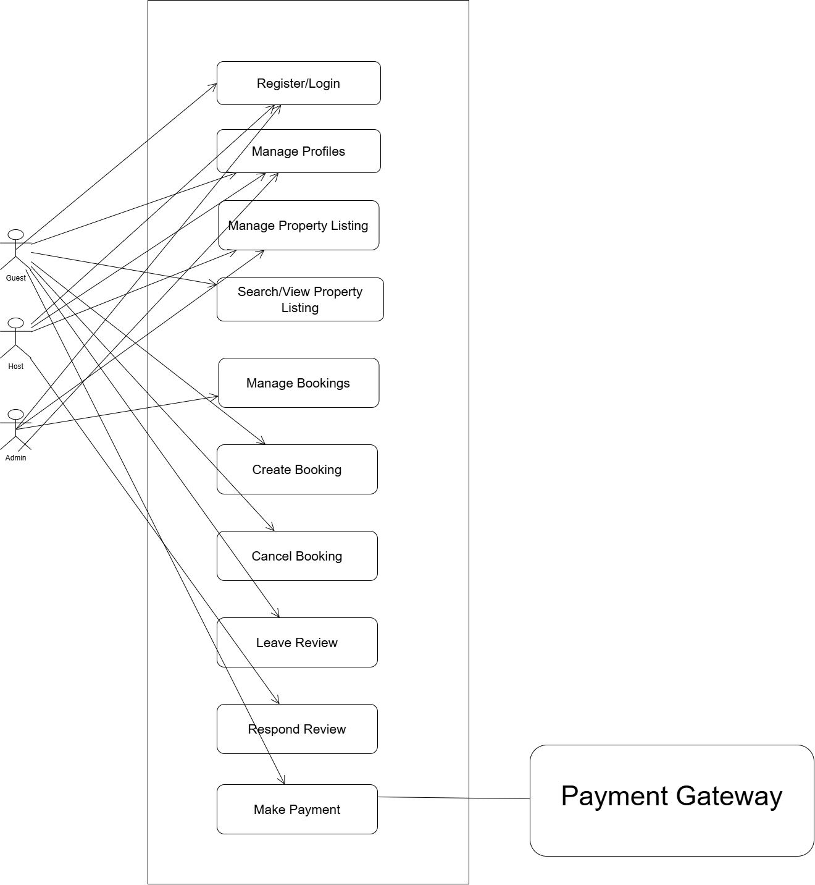

# Use Case Diagram for Airbnb Clone

## Objective
The objective of Use Case Diagram is to show how users interact with a system.

## Actors
* **Guest:** Searches, books, pays, and reviews properties.
* **Host:** Manages property listings and booking approvals.
* **Admin:** Oversees user management, transactions, and reports.
  

